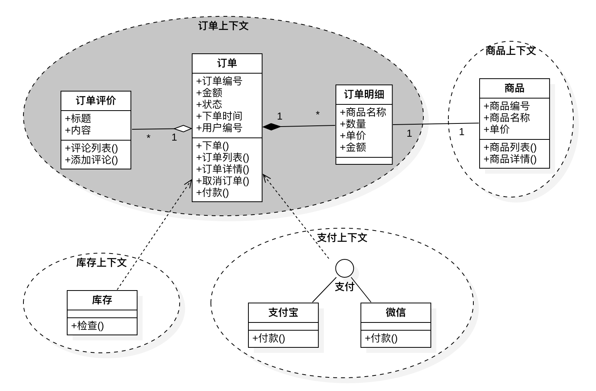
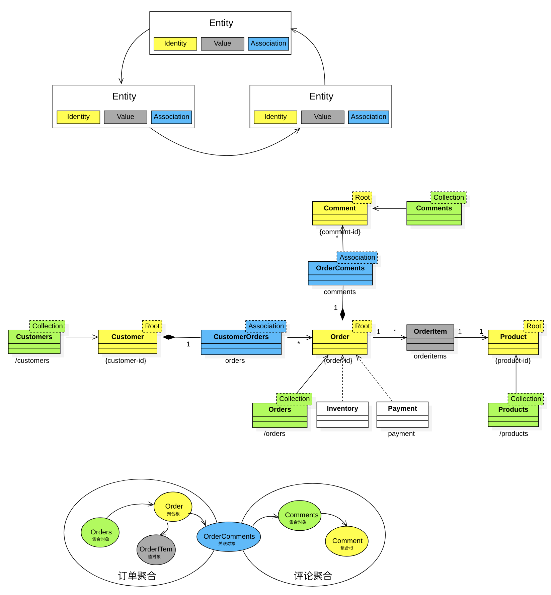

## smart-ddd-scaffold

### 建模案例



### 需求

实现订单上下文。

### 传统DDD的困境

```text
领域驱动设计实现逻辑：先找到领域模型，再找到他们之间的聚合和引用关系，然后通过他们之间的聚合和引用关系把业务表达出来，最后通过聚合和实体范围做为业务一致性的边界。
聚合边界同时也意味着生命周期的边界，同时创建和销毁的实体往往在同一个聚合并拥有相同的生命周期。跨生命周期访问实体往往通过Repository去加载不同聚合不同生命周期的实体。
```

1. 通过领域上下文和聚合边界来保持业务的一致性，外部对象只能引用聚合根不能引用非聚合根的实体。
2. 领域服务的现状：跨生命周期完成业务领域某种程度的一致性。领域服务会把领域概念中需要维持一致性的业务逻辑从它的一致性边界中移出去，会将DDD变得越来越贫血。

### Smart DDD模式方法论



1. 纯粹的面向对象，没有service和manager等贫血对象。
2. 所有模型设计成完全连接的对象图，中间不存在孤立的对象。
3. 所有的模型概念映射为RESTful API并通过HATEOAS连接。
4. 成为屏蔽实现细节的抽象层。
5. 在概念模型/模型/API之间形成完全的映射和一致，看到API能想到模型的能力暴露，是一个完全充血的模型。

全局实体关键对象：

1. 实体集合对象(Entity Collection Object): 类比为某个实体的群体或数据库，负责该实体生命周期管理例如查询、创建、删除、更新等生命周期操作。
   举例`Orders.findByXXX()、Orders.create()、Orders.cancel()`等更符合业务逻辑的语义。只要不是一个实体的业务逻辑都可以抽象到集合逻辑上。
2. 聚合根对象(Aggregation Root Object): 单个实体具有的行为，例如实体与其他实体关联关系的行为`Orders.of(id).getComments().create()`。
3. 实体关联对象(Entity Association Object): 实体之间的关系存在跨聚合或跨生命周期的引用，传统DDD理论由于外部实体不能引用非聚合根之外的实体原则只能通过领域服务(Domain Service)去加载其他聚合的实体导致业务一致性从领域中剥离出去。
   Smart DDD抽象实体之间的关联关系(association)，从而达到领域之间的分层与隔离。

### 指南

#### 分层

* domain: 定义实体和实体之间的关系。
* api: 基于domain层定义的对象关联图暴露API。
* infrastructure: 数据持久化层。管理领域对象生命周期具体的实现。
* main: 应用启动入口。

区别

1. 改进了传统DDD中的展现层(Presentation Layer)，展现层主要响应用户的操作，在Smart DDD中直接将模型概念映射为RESTful API更能体现领域模型的业务能力。
2. 去掉了传统DDD中的应用层(Application Layer)，应用层主要用来协调不同聚合之间的协作，在Smart DDD中通过实体关联对象(Entity Association Object)完成。

#### 注意事项

1. 分层需要权衡：适当的分层促进解耦，过度的分层破坏抽象。
2. 没有service层，所有service层的领域逻辑需要回到domain层保持领域模型是`充血模型`。

#### 脚手架

1. 使用Mybatis的目的：domain层可以与Spring Jpa解耦。

### 本地运行

`./gradlew clean :main:bootRun`

### 参考

1. [整洁架构](https://blog.cleancoder.com/uncle-bob/2012/08/13/the-clean-architecture.html)
2. [Hexagonal Architecture](https://herbertograca.com/2017/11/16/explicit-architecture-01-ddd-hexagonal-onion-clean-cqrs-how-i-put-it-all-together/)
3. [阿里COLA](https://github.com/alibaba/COLA)
4. [Smart DDD](https://github.com/Business-Oriented-Design/business-oriented.design)
5. [CRC建模](http://c2.com/doc/oopsla89/paper.html)
